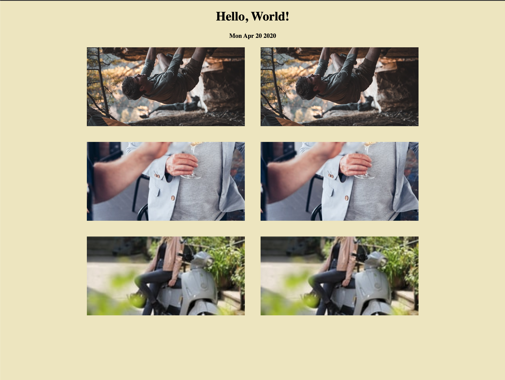

## Week 1
### Intro to HTML, CSS, and Javascript

1. Create a new file called `index.html` with this content:
    ```html
    <!DOCTYPE html>
    <html>
      <head>
        <title>My webpage!</title>
      </head>
      <body>
        <h1>Hello, World!</h1>
        <h4 id='date'></h4>
      </body>
    </html>
    ```
2. Create a new file in the same directory called `index.js` with this content:
    ```javascript
    document.getElementById('date').innerHTML = new Date().toDateString();
    ```
   This will find the element we created above with id of "date" and add the current date to its inner html
3. Add in a `script` tag at the bottom of our html referencing our newly created javascript
    ```html
    <script async src="./index.js"></script>
    ``` 
   This simply imports our newly created javascript file
4. Create a new file called `styles.css` that will contain our styles:
    ```css
    body {
      text-align: center;
      background-color: #f0e8c5;
    }
    ```
6. Before we move any futher, let's view our page in the browser. 
   Simply right click on the index.html file and open it up in your favorite browser. 
5. Now, let's add in some images to our html file at the bottom of our `<body>`:
    ```html
    <div class="images">
        
        
        
        
    </div>
    ```
   These images are random images and by using the `img` tag, we can easily display them on the browser.
6. Finally, let's update our css to handle our newly displayed images:
    ```css
    img {
    	height: 100%;
    	width: 100%;
    	max-width: 400px;
    	max-height: 200px;
    	padding: 20px 20px;
    }
    
    .images {
    	display: flex;
    	flex-direction: row;
    	flex-wrap: wrap;
    	justify-content: center;
    }
    ```
   This will tell the browser what size we want our images to be as well as how they should be displayed on the page in relation to one another
7. Refresh our page in the browser to see our newly created webpage!

